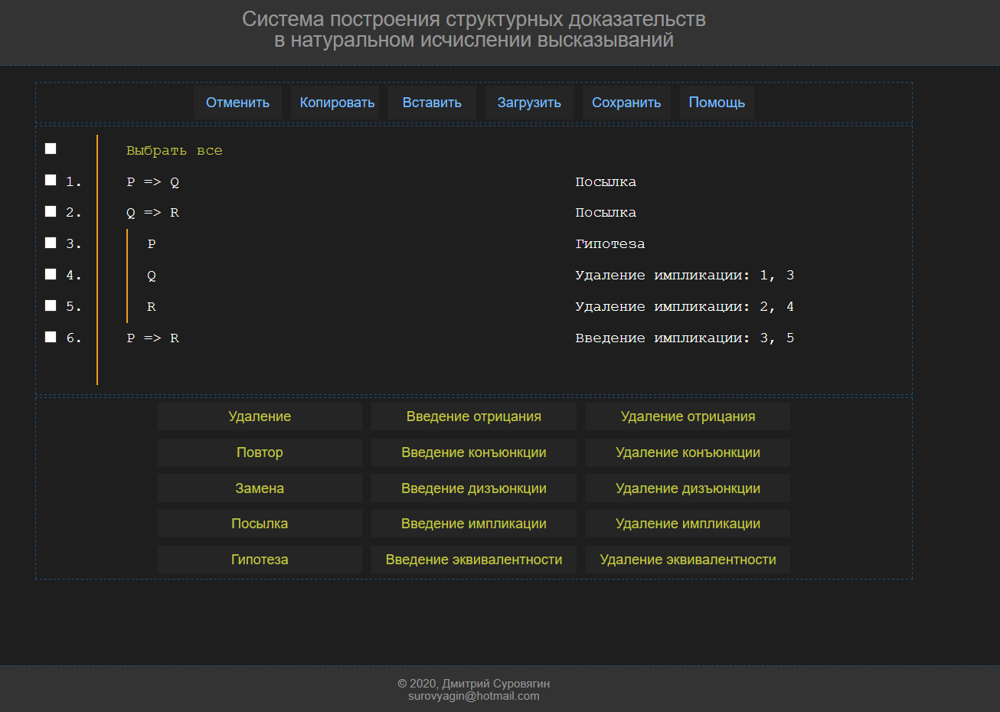

# epam_xt_final_project
*Репозиторий финального проекта по внешнему курсу компании Epam*

## Тема проекта
Система построения структурных доказательств в натуральном исчислении высказываний.

## Функциональность
1. Регистрация пользователей.
2. Хранение информации о пользователе в базе данных.
3. Возможность построения формальных структурных доказательств в системе натурального исчисления высказываний.
4. Сохранение/загрузка доказательств в формате XML.
5. Функции отмены и сохранения в буфере обмена части доказательства.
6. Функции копирования/вставки доказательств через буфер обмена.
7. Страница помощи пользователю.

## Установка
1. Для установки полной версии проекта нужно через MS Visual Studio запустить файл решения Structural_Proof_System.sln из папки Structural_Proof_System и доустановить необходимые пакеты.
2. В MS SQL Server Managment Studio запустить скрипт создания базы данных Create_DB_script.sql из папки DB.
3. Для работы с упрощённой версией достаточно запустить файл index.html из папки Simple_version в браузере Chrome или Firefox (в других браузерах может не поддерживать сохранение доказательств в xml-формате).
4. В упрощённой версии не доступна регистрация и сохранение пользователей, весь остальной фукнционал сохранён.

